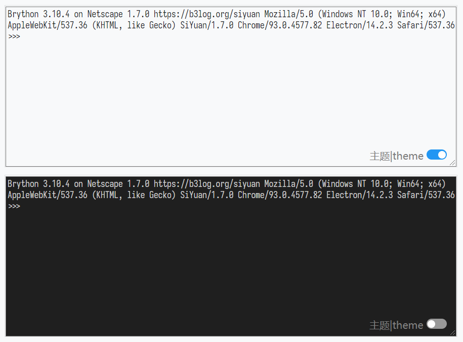

# Brython 控制台挂件 / widget-brython-console

一个简单可离线运行的的 Brython 控制台挂件 
A sample, offline-running widget of Brython Console.

现已上架[思源笔记社区集市](https://github.com/siyuan-note/bazaar), 如果您需要订阅[思源笔记](https://github.com/siyuan-note/siyuan)增值服务，欢迎使用我的推荐码: **h0sc9rc** 
It is now on the shelves of the [Siyuan Notes Community Bazaar](https://github.com/siyuan-note/bazaar). If you need to subscribe to the value-added services of [siyuan note](https://github.com/siyuan-note/siyuan/blob/master/README_en_US.md), please use my referral code: **h0sc9rc**

---

# 预览 / PREVIEW

# 功能 / FUNCTION

- 离线使用 Brython 库交互式运行 Python 脚本 
  Run Python scripts offline using the Brython library interactively.
  - Brython 库所实现的模块详见 [Brython documentation](https://brython.info/static_doc/en/intro.html) 
    Details of the modules implemented by the library can be found at [Brython documentation](https://brython.info/static_doc/en/intro.html)
- 可拖动的工具栏 
  A removable toolbar.
  - 一个`亮色`与`暗色`主题切换开关 
    A switch for switching between `Light` and `Dark` themes.

# 开始 / START

## 自动 / AUTO

该挂件已在[思源笔记社区集市](https://github.com/siyuan-note/bazaar)上架, 可直接在集市中安装 
The widget has been put on the shelves at [SiYuan community bazaar](https://github.com/siyuan-note/bazaar) and can be installed directly in the Bazaar.

## 手动 / MANUAL

1. 在 [./releases](./releases) 中下载发行包, 解压后放到[思源笔记](https://github.com/siyuan-note/siyuan) `<工作空间>/data/widgets/` 目录下 
   Download the release package in [./releases](./releases), unzip it and place it in the `<workspace>/data/widgets/` directory of [SiYuan Note](https://github.com/siyuan-note/siyuan)
2. 在笔记中创建一个 `IFrame` 块, 地址填 `/widgets/widget-brython-console` 即可 
   Create an `IFrame` block in your notes with the address filled in `/widgets/widget-brython-console`

# 依赖 / DEPENDENCE

## 源码 / SOURCE

- [GitHub - brython-dev/brython: Brython (Browser Python) is an implementation of Python 3 running in the browser](https://github.com/brython-dev/brython) *[BSD\-3\-Clause License](https://github.com/brython-dev/brython/blob/master/LICENCE.txt)*

# 更改日志 / CHANGE LOG

[CHANGE LOG](./CHANGELOG.md)
